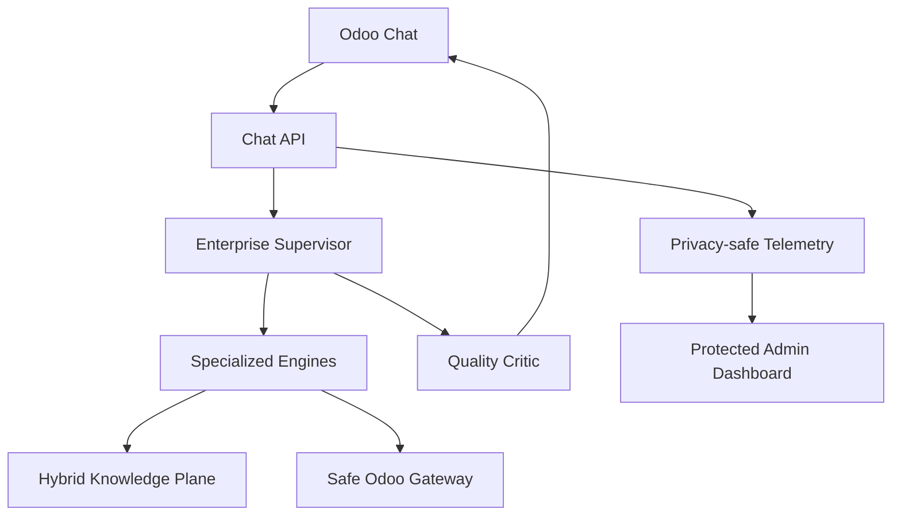

# V28 Architecture

The supervisor decomposes the current message, quarantines stale context when necessary, selects specialized engines, and checks task coverage, live-data provenance, agricultural safety, question budget, and natural formatting before the response is returned.

The knowledge plane uses the 400 MB V27 corpus as a resilient local fallback. When configured, external file search supplies a scalable document layer without putting multi-gigabyte content in the Vercel function bundle or Git repository.
